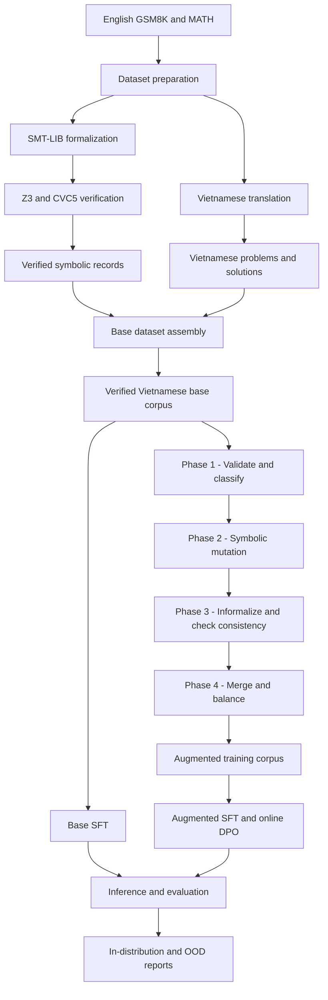

# Vi-Math-SMT

> A formally verified data pipeline for Vietnamese mathematical reasoning,
> combining SMT-LIB generation, Z3/CVC5 validation, symbolic augmentation,
> supervised fine-tuning, and online preference optimization.

[](https://www.python.org/)
[](https://smt-lib.org/)
[](https://github.com/Z3Prover/z3)
[](LICENSE)
[](#project-status)

Vi-Math-SMT builds Vietnamese mathematical reasoning data from GSM8K and
MATH while preserving a machine-checkable representation of each problem.
The project formalizes English source problems as SMT-LIB, validates them with
SMT solvers, translates the natural-language content into Vietnamese, and
merges both branches into a unified training corpus. A four-phase augmentation
pipeline then generates new verified problems through symbolic mutation and
LLM-based informalization.

The repository also contains the complete experiment workflow for training and
evaluating Vietnamese math language models with SFT and online DPO.

## Highlights

- **Formally verified reasoning data** - generated SMT-LIB is checked against
  the reference answer with Z3, with CVC5 support in the MATH workflow.
- **Parallel construction pipeline** - formalization and Vietnamese
  translation run independently before being joined by sample index.
- **Solver-guided augmentation** - symbolic mutations are validated before an
  LLM converts them back into natural Vietnamese problems and solutions.
- **Consistency filtering** - informalized answers are compared with solver
  outputs before augmented samples enter the final corpus.
- **End-to-end experiments** - numbered notebooks cover preparation, SFT,
  online DPO, inference, in-distribution evaluation, and OOD evaluation.
- **Reproducible intermediate evidence** - selected `*.outputs.md` files retain
  captured execution output for inspection alongside the corresponding code.

## Verified Data-Construction Results

The following figures describe the data pipeline, not model fine-tuning or
model quality. They are taken from the recorded execution outputs committed
with the corresponding processing code.

| Data-processing result | Verified value | Evidence |
| --- | ---: | --- |
| GSM8K records formalized and accepted | 7,473 / 7,473 (100.0%) | [`gsm8k_formalize_evaluate.outputs.md`](src/formalize/gsm8k/gsm8k_formalize_evaluate.outputs.md) |
| MATH records retained after formalization and filtering | 7,397 / 7,500 (98.63%) | [`merge_all.outputs.md`](src/merge/merge_all.outputs.md) and the 7,500-record source definition in [`download_datasets.py`](src/convert/download_datasets.py) |
| Verified Vietnamese base corpus | 14,870 records | [`merge_all.outputs.md`](src/merge/merge_all.outputs.md) |
| Base-corpus composition | 7,473 GSM8K + 7,397 MATH | [`merge_all.outputs.md`](src/merge/merge_all.outputs.md) |
| Base records containing verified SMT-LIB | 14,870 / 14,870 (100.0%) | [`merge_all.outputs.md`](src/merge/merge_all.outputs.md) |
| Augmented candidates evaluated | 27,024 records | [`phase3_analyze.outputs.md`](src/mutation_informalize/analysis/phase3_analyze.outputs.md) |
| Consistent augmented records accepted | 19,750 / 27,024 (73.1%) | [`phase3_analyze.outputs.md`](src/mutation_informalize/analysis/phase3_analyze.outputs.md) |
| Augmented candidates rejected | 7,274 / 27,024 (26.9%) | [`phase3_analyze.outputs.md`](src/mutation_informalize/analysis/phase3_analyze.outputs.md) |
| Initially failed candidates rescued during cleanup | 255 records | [`phase3_analyze.outputs.md`](src/mutation_informalize/analysis/phase3_analyze.outputs.md) |
| Source problems with at least one accepted mutation | 5,670 / 6,817 (83.2%) | [`phase3_analyze.outputs.md`](src/mutation_informalize/analysis/phase3_analyze.outputs.md) |
| Final base-plus-augmentation training corpus | 34,620 records | Derived from 14,870 verified base records + 19,750 accepted augmented records |

### Augmentation validation breakdown

| Validation view | Recorded result |
| --- | --- |
| Rescue methods | 148 numeric matches, 83 normalized string matches, 24 symbolic SymPy matches |
| Consistency by subject | 63.3% to 79.5% across the seven MATH subjects |
| Consistency by difficulty | Level 1: 70.3%; Level 2: 72.5%; Level 3: 73.2%; Level 4: 74.5%; Level 5: 73.0% |
| Consistency by mutation strategy | M0: 73.0%; M1: 72.6%; M2: 73.0%; M3: 73.2%; M4: 73.9% |
| Accepted mutations per covered source | 593 sources produced 1; 1,306 produced 2; 795 produced 3; 720 produced 4; 2,256 produced 5 |
| Final-corpus composition | 42.95% verified base records and 57.05% accepted augmented records |
| Accepted problem length | Mean 343 characters; median 291; range 21 to 3,143 |
| Accepted solution length | Mean 904 characters; median 808; range 156 to 6,005 |

Subject-level consistency was 67.9% for algebra, 63.3% for counting and
probability, 73.9% for geometry, 76.6% for intermediate algebra, 74.2% for
number theory, 79.5% for prealgebra, and 76.6% for precalculus. All values in
this breakdown come from
[`phase3_analyze.outputs.md`](src/mutation_informalize/analysis/phase3_analyze.outputs.md).

These results establish record counts, solver coverage, and augmentation
consistency only. Fine-tuning and model-evaluation results are intentionally not
reported in this README.

## System Architecture



The formalization and translation branches intentionally originate from the
same source records. Formalization is performed on English text to reduce
language-induced ambiguity in symbolic generation; verified SMT-LIB is joined
with the Vietnamese translation only after both branches complete.

## Pipeline

| Stage | Purpose | Main implementation |
| --- | --- | --- |
| 1. Acquire and normalize | Download benchmark data and standardize source formats | `src/convert/`, `src/analysis/` |
| 2. Formalize | Generate SMT-LIB and run generate–verify–repair loops | `src/formalize/gsm8k/`, `src/formalize/math/` |
| 3. Translate | Translate problems and solutions while preserving math and LaTeX | `src/translate/gsm8k/`, `src/translate/math/` |
| 4. Assemble | Join verified symbolic data with Vietnamese records and normalize the schema | `src/merge/` |
| 5. Augment | Validate, mutate, informalize, verify, merge, and balance MATH-derived samples | `src/mutation_informalize/` |
| 6. Train | Prepare data, run base/augmented SFT, then online DPO | `notebooks/00_*.py` to `notebooks/03_*.py` |
| 7. Evaluate | Run inference, in-distribution analysis, OOD tests, and final aggregation | `notebooks/04_*.py` to `notebooks/06_*.py`, `src/evaluate/` |

### Formalization strategies

- **GSM8K:** a LangGraph-based agent generates SMT-LIB, validates it with Z3,
  and retries with solver feedback when parsing, satisfiability, or answer
  checks fail.
- **MATH:** a sequential repair loop normalizes symbolic answers, generates
  SMT-LIB, and validates difficult mathematical expressions with Z3/CVC5-aware
  checks.

### Four-phase augmentation

1. **Validate and classify** the base SMT records and select eligible sources.
2. **Mutate symbolically** using constant, structural, expression, constraint,
   and difficulty transformations; validate every candidate with Z3.
3. **Informalize** each accepted symbolic variant into a Vietnamese problem and
   solution, then compare the generated answer with the solver result.
4. **Merge and balance** consistent augmented records with the original corpus.

Augmentation is focused on MATH because its richer algebraic and symbolic
structures provide more useful mutation space than the predominantly linear
arithmetic problems in GSM8K.

## Repository Layout

```text
vi-math-smt/
├── notebooks/                     # Ordered training and evaluation workflow
│   ├── 00_prepare_data.py
│   ├── 01_sft_train_base.py
│   ├── 02_sft_train_augmented.py
│   ├── 03_dpo_train_augmented.py
│   ├── 04_inference_base.py
│   ├── 05_inference_augmented.py
│   └── 06_final_evaluation.py
├── src/
│   ├── analysis/                  # Source-data normalization utilities
│   ├── convert/                   # Dataset download and format conversion
│   ├── formalize/
│   │   ├── gsm8k/                 # Agentic GSM8K formalization
│   │   └── math/                  # MATH formalization and repair
│   ├── translate/
│   │   ├── gsm8k/                 # GSM8K Vietnamese translation
│   │   ├── math/                  # MATH Vietnamese translation
│   │   └── test_dataset/          # SVAMP/ASDiv OOD preparation
│   ├── merge/                     # Base-corpus assembly and statistics
│   ├── mutation_informalize/      # Four-phase augmentation pipeline
│   │   ├── analysis/              # Augmentation-quality analysis
│   │   ├── reference/             # Prompt-development references
│   │   └── tools/                 # QC and one-off repair utilities
│   └── evaluate/                  # Base, augmented, OOD, and baseline analysis
├── data/                          # Local datasets/artifacts; not tracked by Git
├── .env.example                   # Required environment variables
├── requirements.txt               # Core pipeline dependencies
└── README.md
```

## Quick Start

### 1. Clone and create an environment

```bash
git clone https://github.com/datdaide1/vi-math-smt.git
cd vi-math-smt

python -m venv .venv
source .venv/bin/activate        # Linux/macOS
# .venv\Scripts\activate         # Windows PowerShell

python -m pip install --upgrade pip
pip install -r requirements.txt
```

The training notebooks install their heavier ML stack separately because the
exact versions depend on the Kaggle/CUDA runtime. See the installation cell at
the top of each notebook source before running it.

### 2. Configure credentials

```bash
cp .env.example .env
```

On Windows PowerShell:

```powershell
Copy-Item .env.example .env
```

Populate only the services required by the stages you plan to run:

| Variable | Used for |
| --- | --- |
| `HF_TOKEN` | Hugging Face dataset/model access |
| `GEMINI_API_KEY` | Vietnamese translation with Gemini |
| `NVIDIA_API_KEY` | Single-key NVIDIA NIM access |
| `NVIDIA_API_KEYS` | Comma-separated key rotation for concurrent generation |
| `BEEKNOEE_API_KEY` | Optional compatibility with legacy proxy-based scripts |

Never commit `.env` or any file containing real credentials.

API keys are access credentials, not redistributable project assets. Every user
must provide their own authorized keys and comply with the relevant provider's
terms, data-handling policy, rate limits, and billing rules. Prompts and dataset
records sent to an external API leave the local environment; review provider
retention and training policies before processing restricted or confidential
data. Use least-privilege tokens where supported, rotate any exposed key
immediately, and keep production credentials out of notebooks and captured
output files.

### 3. Populate local data

Run each script from its own directory. The codebase uses relative paths that
resolve back to the repository-level `data/` directory.

```bash
cd src/convert
python download_datasets.py
python preprocess_gsm8k.py
```

## Running the Core Pipeline

The following commands show the intended execution order. Formalization and
translation can run in parallel once source preparation is complete.

```bash
# From the repository root

# A. Formalize GSM8K
cd src/formalize/gsm8k
python formalize_gsm8k_nvidia_langgraph.py

# B. Formalize MATH
cd ../math
python formalize_math_nvidia.py

# C. Translate GSM8K
cd ../../translate/gsm8k
python translate_gsm8k.py

# D. Translate MATH
cd ../math
python translate_math.py

# E. Assemble the verified Vietnamese base corpus
cd ../../merge/gsm8k
python gsm8k_complete.py
cd ../math
python math_complete.py
cd ..
python merge_all.py

# F. Run the four-phase augmentation workflow
cd ../mutation_informalize
python run_pipeline.py
```

Each stage supports partial reruns when its expected input files already exist.
Several long-running scripts also use append-only output or checkpoint files to
resume interrupted generation.

## Training and Evaluation

The files under `notebooks/` are Python exports of ordered Kaggle notebook
cells. Run them in numerical order:

| Order | Experiment |
| --- | --- |
| `00` | Clean and validate the final training records |
| `01` | Train the base SFT model |
| `02` | Train the augmented SFT model |
| `03` | Apply online DPO with a rule-based mathematical judge |
| `04` | Run base-model inference |
| `05` | Run augmented-model inference, including OOD inputs |
| `06` | Aggregate metrics, analyses, plots, and final reports |

The DPO judge ranks candidate solutions by mathematical correctness first,
format compliance second, and concision third. Evaluation utilities cover final
answer accuracy, formatting behavior, reasoning similarity, performance by
subject and difficulty, and OOD generalization on Vietnamese SVAMP and ASDiv.

## Data and Artifact Policy

The `data/` directory is intentionally excluded from Git because it contains
large, generated, or externally sourced datasets, predictions, plots, and model
artifacts. This repository publishes the pipeline and research implementation,
not a duplicate distribution of those assets.

Expected local data categories include:

```text
data/
├── raw/                 # Downloaded source datasets
├── generate/            # Normalized GSM8K/MATH inputs
├── translation/         # Vietnamese training translations
├── formalize_output/    # Verified SMT-LIB records
├── finetune/            # Base and augmented training corpora
├── result/              # Model predictions
└── evaluate/            # Metrics, reports, and visualizations
```

Paths may be created incrementally as the relevant scripts run. Review the
configuration block at the top of a script before launching an expensive API or
GPU job.

## Dataset Sources and Licensing

This project uses four externally published benchmarks. Their licenses apply to
the original records and to translated or otherwise adapted versions; they are
not replaced by any license chosen for this repository's source code.

| Dataset | Source used by the downloader | Upstream license | Required handling |
| --- | --- | --- | --- |
| GSM8K | [`openai/gsm8k`](https://huggingface.co/datasets/openai/gsm8k) | MIT | Preserve the upstream notice and cite Cobbe et al. (2021). |
| MATH | [`hendrycks/competition_math`](https://huggingface.co/datasets/hendrycks/competition_math) | MIT | Preserve the upstream notice and cite Hendrycks et al. (2021). |
| SVAMP | [`ChilleD/SVAMP`](https://huggingface.co/datasets/ChilleD/SVAMP) | MIT | Cite Patel et al. (2021); prefer the official repository for provenance. |
| ASDiv | [`EleutherAI/asdiv`](https://huggingface.co/datasets/EleutherAI/asdiv) | CC BY-NC 4.0 | Attribution is required; reuse and derived translations must remain non-commercial. |

See [`DATA_SOURCES.md`](DATA_SOURCES.md) for official project links, paper
citations, license links, and redistribution guidance.

Because ASDiv is licensed under CC BY-NC 4.0, a combined release containing
ASDiv-derived records must not be labeled as wholly MIT or presented as
commercially reusable. If processed datasets are published on Hugging Face,
identify the source of each subset, describe translation and filtering as
modifications, retain all attribution notices, and expose the applicable
per-source license restrictions in the dataset card. This repository currently
does not redistribute the source or derived datasets through Git.

## Reproducibility Notes

- Scripts in `src/` generally expect to run from the directory containing the
  script because their data paths are relative.
- The modules in `src/mutation_informalize/` intentionally remain at the same
  directory level because they use same-directory imports such as
  `from config import ...`.
- `*.outputs.md` files are execution records, not executable source files.
- Stochastic LLM generation and symbolic mutation may produce different
  candidates across runs; solver checks and consistency filters define the
  acceptance criteria.
- API usage can incur cost. Start with a small input subset and verify the
  resulting schema before launching a full run.

## Project Status

This is research code organized around an experimental thesis pipeline. It is
provided for inspection, reproduction, and further experimentation rather than
as a production service or a packaged Python library. Model checkpoints and
generated datasets are not bundled with the repository.

## License

Original source code and documentation in this repository are available under
the [MIT License](LICENSE), unless a file states otherwise. This license does
not relicense or override third-party datasets, model weights, generated records
derived from those datasets, or external API/service terms.

In particular, ASDiv and ASDiv-derived records remain subject to CC BY-NC 4.0
and its non-commercial restriction. See [`DATA_SOURCES.md`](DATA_SOURCES.md)
before redistributing any dataset artifact.

## Contributing

Contributions that improve validation, portability, documentation, or
reproducibility are welcome. Before opening a pull request:

1. Keep credentials and generated data outside Git.
2. Preserve the expected input/output schema of the affected pipeline stage.
3. Run `python -m compileall -q src notebooks`.
4. Document new environment variables and generated artifact paths.
5. Include a focused description of the change and how it was validated.

## Acknowledgements

This project builds on GSM8K, MATH, SVAMP, ASDiv, SMT-LIB, Z3, CVC5,
LangGraph, Gemini, NVIDIA NIM, Hugging Face, Unsloth, and the broader open-source
mathematical reasoning ecosystem.
